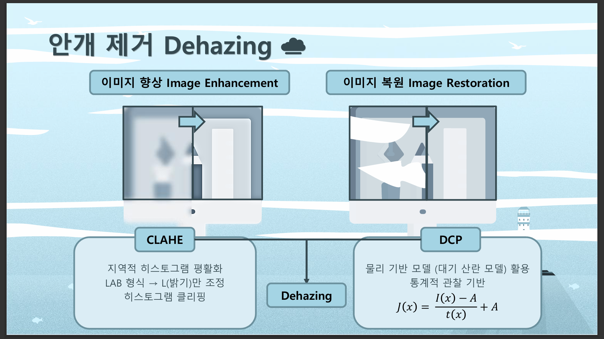
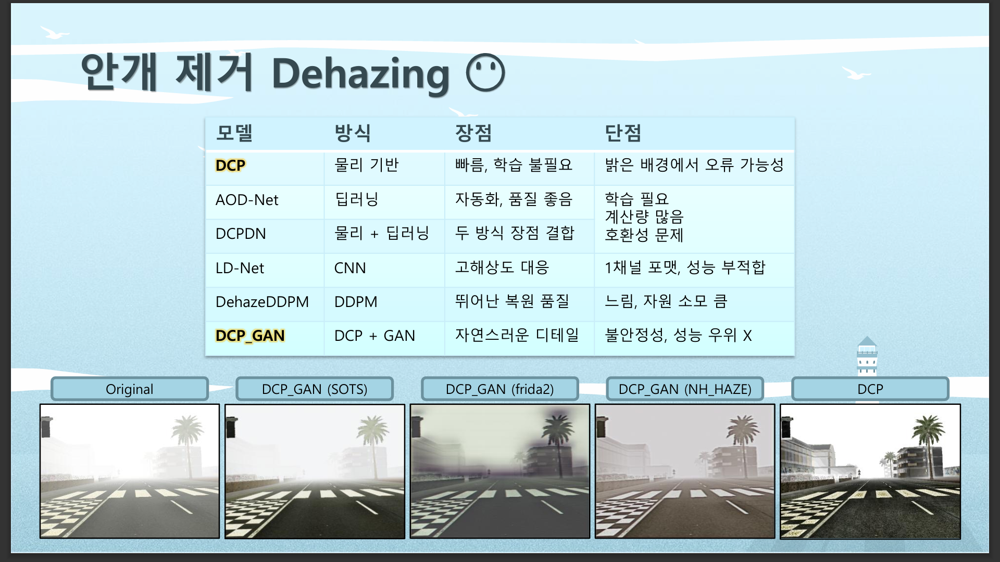
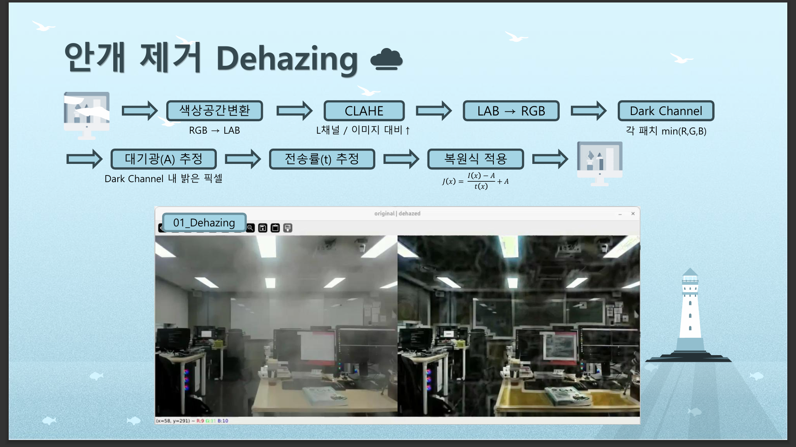
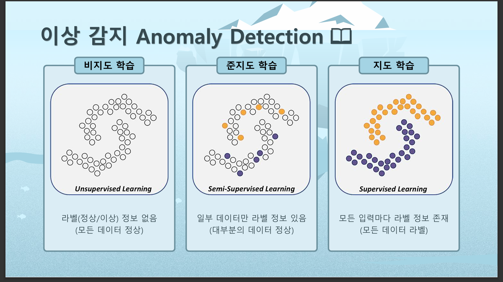
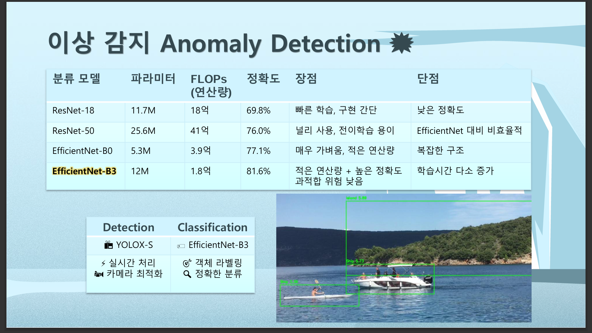
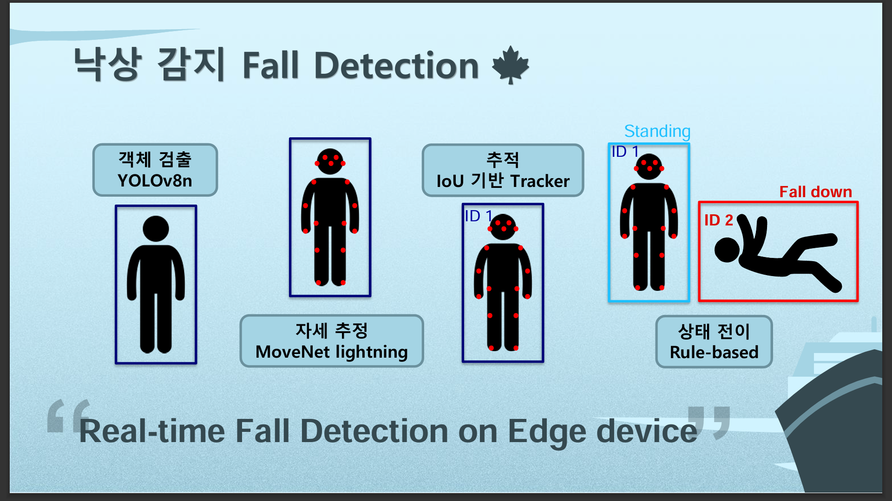
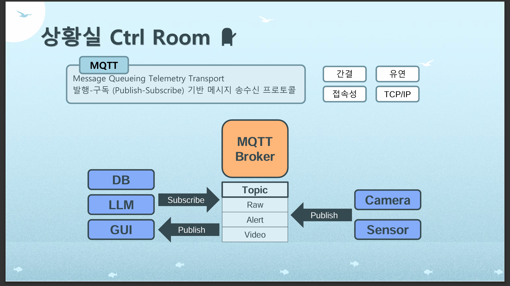
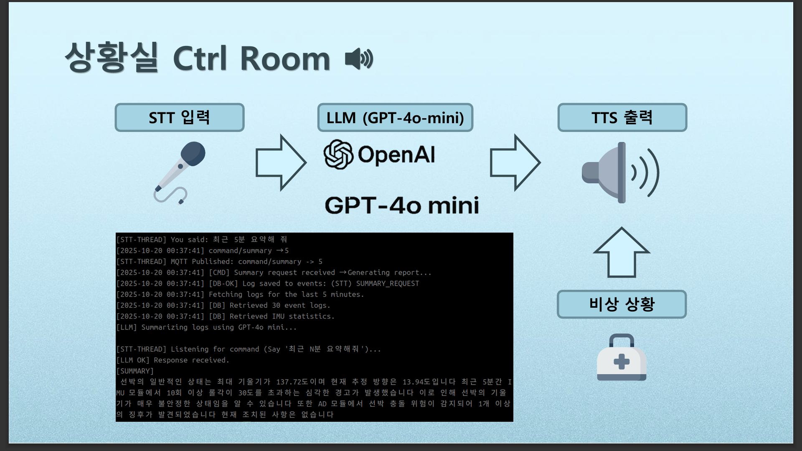

# AI 기반 선박 제어실 보조 On-Device 시스템
> AI 분석 결과를 실시간 관제·기록·브리핑 시스템으로 연결한
> 선박 제어실 보조 On-Device 시스템
## 🏆 **인텔 엣지 AI 실무 프로젝트 경진대회 최우수상 수상**

## 1. 프로젝트 개요

본 프로젝트는 해상 환경에서 발생하는 **시야 저하**(안개)와 **선원 안전 사고**에 대응하기 위해,
AI 기반 컴퓨터 비전과 서버 시스템을 결합한 **선박 제어실 보조 On-Device 시스템**입니다.

특히 본 시스템은,
- 실시간 영상 기반 이상 상황 인지
- 이벤트 중심 데이터 수집 및 기록
- 관제실에서 즉각적인 판단을 돕는 UI 제공

에 초점을 맞추어 설계되었습니다.

### 전체 시스템 구상도

---

## 2. 기술 스택

### On-Device / Edge

### AI / Vision

### Server / System

---

## 3. 핵심 기능

- **안개 제거 및 이상 감지 파이프라인**:
   - **CLAHE 기법**과 **DCP(Dark Channel Prior)** 기법을 사용하여 안개를 제거
   - **YOLOX-S**와 **EfficientNet-B3** 모델을 활용해 **이상 객체 탐지** 및 **라벨링** 실시간 수행

- **선원 안전 이벤트 감지 파이프라인**: 
   - **YOLOv8n** 모델로 **갑판 위 선원** 객체 탐지
   - **MoveNet Lightning** 모델로 **선원의 자세를 추정**, **fall down 상태**가 감지되면 서버로 **위험 알림** 전송
   - 특정 영역을 위험 구역으로 설정하고, 해당 구역에 사람이 있을 경우 **경고** 발송

- **운항 기록 자동화 파이프라인**:
   - **LLM (대형 언어 모델)**을 활용
   - **STT (음성 인식)**와 **TTS (음성 합성)**로 선원 명령 처리와 **자동 항해 일지 작성** 및 **브리핑** 제공

- **실시간 데이터 처리 파이프라인**: 
   - 각 모듈에서 **MQTT**를 통해 데이터를 실시간으로 서버로 전송
   - **이상 감지**, **낙상 감지**, **위험 객체 감지** 등의 데이터 처리 및 저장
   - 실시간으로 처리된 데이터는 **모니터링 UI**를 통해 상황실에서 즉각 확인 가능 

---

## 4. 핵심 기술 선택 및 구현 이유

### 1) **CLAHE (Contrast Limited Adaptive Histogram Equalization)** 기법
   - **목표**: 저조도 환경에서 이미지를 향상시켜 **선명한 시야** 확보
   - **기법**: 각 이미지 영역에 대해 **대비 향상**을 수행하여 안개 상태에서도 선명한 이미지 제공

### 2) **DCP (Dark Channel Prior)** 기법
   - **목표**: 이미지에서 **안개**를 제거하여 더욱 명확한 시야 제공
   - **기법**: 이미지의 **어두운 채널**을 사용해 안개 농도를 추정하고 이미지 복원

### 3) **YOLOX-S & EfficientNet-B3** 모델을 활용한 **이상 감지**
   - **목표**: 실시간으로 **이상 객체** 탐지
   - **기법**: **YOLOX-S** 모델을 사용하여 객체를 탐지하고, **EfficientNet-B3** 모델로 객체를 라벨링

### 4) **YOLOv8n 모델**을 활용한 **낙상 감지**
   - **목표**: 갑판 위 **선원 객체** 감지 및 **낙상** 상태 감지
   - **기법**: **YOLOv8n** 모델로 선원을 객체 탐지하고, **MoveNet Lightning**으로 자세를 추정하여 낙상 감지

### 5) **LLM**, **STT**, **TTS**를 활용한 **자동 항해 일지 작성 및 브리핑**
   - **목표**: **항해 일지** 자동 작성 및 **브리핑** 제공
   - **기법**: **STT**로 음성 인식, **TTS**로 실시간 브리핑 음성 제공, **LLM**으로 항해 일지 자동 작성

---

## 5. 역할 및 기여

- **MQTT 기반 실시간 통신 구조 설계 및 구현**
  - 선박 단말(On-Device) ↔ 서버 간 이벤트/상태 데이터 송수신
  - 이상 감지, 낙상 감지, 위험 이벤트를 topic 기반으로 분리 설계

- **MariaDB 기반 서버 DB 설계 및 연동**
  - 이상 감지 로그, 낙상 이벤트, 시스템 상태 로그 저장
  - 자동 항해 일지 작성을 위한 데이터 구조 설계
  - 서버–DB 간 데이터 흐름 관리

- **PyQt6 기반 상황실(Control Room) GUI 구현**
  - 실시간 로그 모니터링 UI 구성
  - 이벤트 발생 시 시각적 알림 및 상태 표시
  - MQTT 수신 데이터 기반 UI 동적 갱신

- **LLM 기반 자동 항해 일지 작성 시스템 구현**
  - 수집된 이벤트/상태 로그를 구조화하여 LLM 입력 프롬프트 설계
  - 항해 중 발생한 주요 이벤트를 자연어 항해 일지로 자동 생성

- **STT / TTS 기반 음성 인터페이스 연동**
  - STT를 통한 음성 명령 처리 및 상황 보고 입력
  - TTS를 활용한 항해 요약 및 브리핑 음성 출력
  - GUI 및 서버 로직과 연동하여 실시간 음성 피드백 제공

---

## 6. 트러블슈팅

### 1) PyQt에서 실시간 이미지 표시 시 프레임 저하 문제
- 문제: 서버에서 수신한 이미지 프레임을 PyQt GUI에 실시간으로 출력할 때 FPS 저하 및 화면 끊김 발생
- 원인: 
  - MQTT는 경량 메시지 전송에 최적화된 프로토콜로, 영상/이미지 스트리밍에 구조적으로 부적합
  - 이미지 데이터를 Base64 문자열로 전송·복원하면서 CPU 부하 증가
  - PyQt GUI에서 다수의 이미지 디코딩·렌더링을 동시에 처리하며 렌더링 병목 발생
- 해결:
  - 이미지 해상도 축소 및 포맷 단순화로 전송 데이터 최소화
  - MQTT 환경에서 바이너리 스트리밍이 어려워 Base64 전송 방식을 유지하되,
    이미지 해상도 축소 및 UI 갱신 최소화로 병목을 완화
  - UI 갱신 주기 조절 및 불필요한 전체 화면 갱신 제거
- 결과: 실시간 영상 품질에는 한계가 있었으나, 상황 인지용 모니터링이 가능한 수준까지 성능 개선

### 2) PyQt GUI 실시간 업데이트 시 UI 멈춤 현상
- 문제: MQTT 메시지를 직접 UI 스레드에서 처리하며 화면이 일시적으로 멈춤
- 원인: 네트워크 I/O와 GUI 렌더링을 동일 스레드에서 처리
- 해결: MQTT 수신 로직을 별도 스레드로 분리하고 signal-slot 구조로 UI 갱신
- 결과: 실시간 로그 출력 시에도 GUI 응답성 유지

### 3) LLM 자동 항해 일지 생성 품질 불안정
- 문제: 동일한 이벤트 로그라도 항해 일지 문장이 일관되지 않거나 핵심 정보 누락
- 원인: 입력 로그 포맷이 비정형적이며 프롬프트 구조가 불명확
- 해결: 이벤트 로그를 시간순·유형별로 정리한 프롬프트 템플릿 설계
- 결과: 항해 일지의 일관성 및 가독성 향상

---

## 7. 배운 점

- MQTT 브로커를 중심으로 한 Publish/Subscribe 통신 구조를 처음 설계·적용하며, 다수의 디바이스와 서버 간 이벤트 전달 방식과 비동기 메시지 흐름에 대한 이해를 확장함
- MariaDB와 연동된 로그 저장 구조를 설계하며, 실시간 이벤트 데이터를 구조화해 저장·조회하는 서버–DB 파이프라인 구성 경험을 쌓음
- PyQt 기반 GUI를 구현하며, 실시간 데이터 수신·렌더링 과정에서 UI 응답성과 시스템 안정성을 동시에 고려한 설계의 중요성을 체감함
- STT·TTS 및 LLM을 시스템에 통합하며, 비정형 이벤트 로그를 사용자 친화적인 음성·텍스트 인터페이스로 변환하는 흐름을 이해함
- 여러 모듈이 동시에 동작하는 환경에서 통신, DB, UI를 조율하며 실시간 시스템 전반의 데이터 흐름과 병목 지점을 설계 관점에서 학습함
  
---

## 🚢 Team / 프로젝트 상세

- 팀명: **CTRL SEA CTRL VISION**
- 개발 기간: **2025.09.26 ~ 2025.10.22**
- 발표 자료: [[Ctrl + Click Here]](https://drive.google.com/drive/folders/1VzminDn5eenhiwE3JjTkIos7xjNJQT3j?usp=sharing)

### 👥 팀원 소개
| 이름 | 담당 |
|------|------|
| **문두르** | PM |
| **류균봉** | Image Enhancement / Dehazing |
| **나지훈** | Server / MQTT / GUI / LLM / STT / TTS |
| **김찬미** | Pose Estimation / Fall Detection |
| **이환중** | Object Detection / Anomaly Detection |

<b>📷 시스템 데모/스크린샷 더 보기 (펼치기)</b>

### 1) 안개 제거 (Dehazing)

### 2) 이상 감지 (Anomaly Detection)

### 3) 낙상 감지 (Fall Detection)

  
  

### 4) 상황실 (Control Room)

